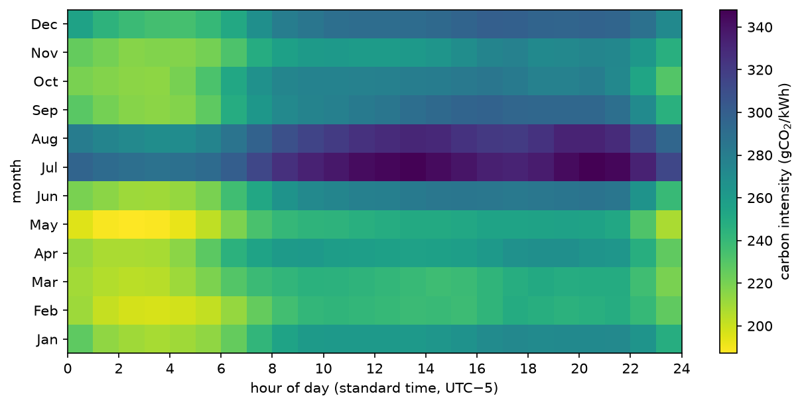
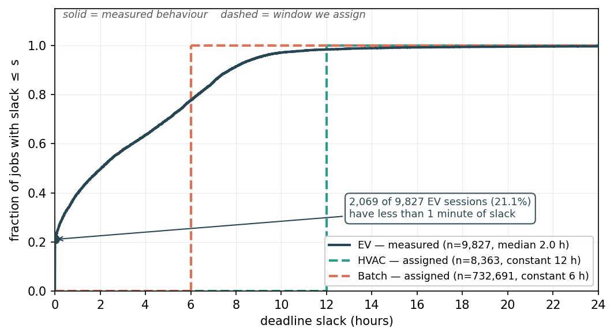
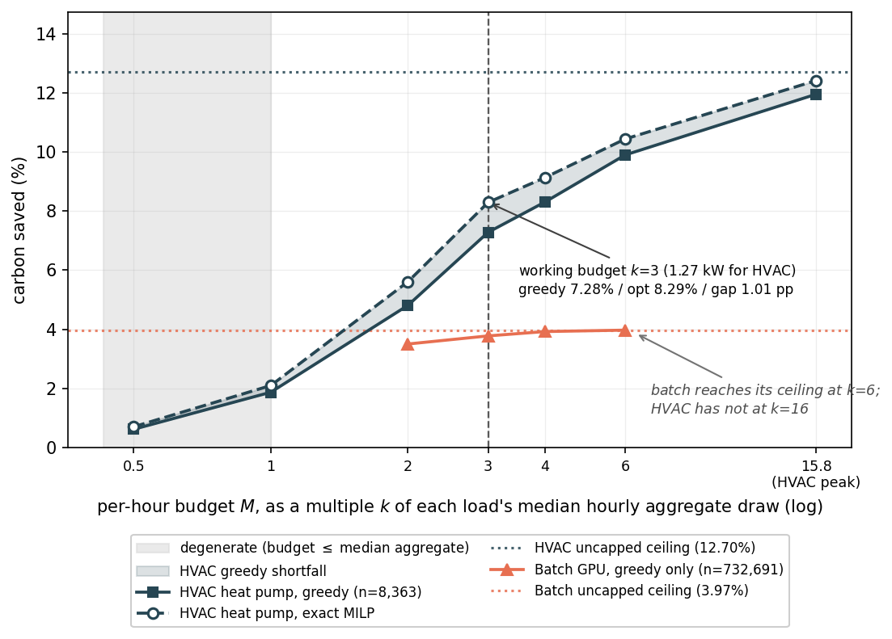
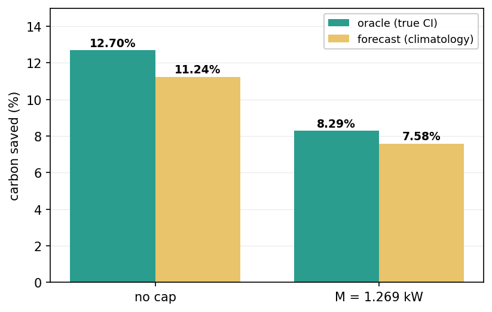
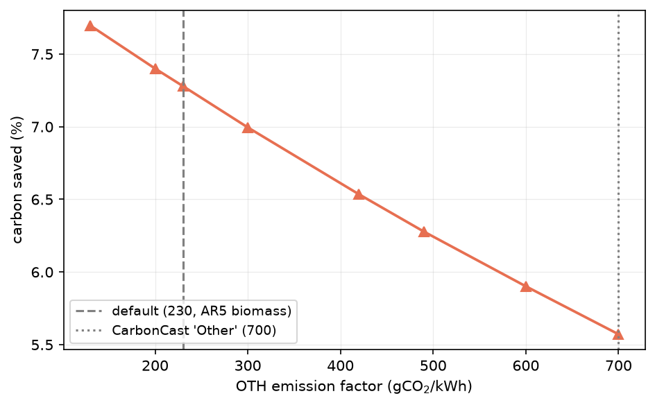

<!-- README for the Carbon-Aware Load Scheduling repository -->

# Carbon-Aware Load Scheduling

### What a Per-Hour Power Budget Costs You When Shifting Flexible Loads into Clean Grid Hours

This repository contains the data, code, and figures behind a measurement of how much CO<sub>2</sub> is actually avoidable by deferring flexible electrical loads into low-carbon hours. Public EIA fuel-mix data becomes an hourly grid carbon intensity; three real load traces — residential heat-pump HVAC, EV charging, and GPU batch compute — become deferrable jobs with deadlines; and each job is placed at its cheapest feasible hour, both by a greedy rule and by an exact MILP. The pipeline's point is the constraint that is usually left out: a **per-hour power budget**, which turns out to bind harder than deadline flexibility does.

> **Headline result.** Given perfect foresight and no power limit, shifting one Massachusetts heat pump's 8,363 hourly HVAC blocks into cleaner ISO-NE hours avoids **12.70%** of its annual HVAC emissions. Impose a per-hour budget of just 3× the median active draw (**1.269 kW**) and the attainable saving falls to **8.29%**, of which a greedy rule captures **7.28%** — a 1.01 pp optimality gap. The budget, not the flexibility, sets the ceiling.

---

## Authors

| Author | Affiliation |
|---|---|
| Rajan Saha | Conestoga High School, Berwyn, PA, USA; Boston University RISE Program, Boston, MA, USA |
| Allan Yu | Fairview High School, Boulder, CO, USA; Boston University RISE Program, Boston, MA, USA |
| Rashanjot Kaur | Department of Computer Science, Metropolitan College, Boston University, Boston, MA, USA |
| Eugene Pinsky (corresponding — epinsky@bu.edu) | Department of Computer Science, Metropolitan College, Boston University, Boston, MA, USA |

Submitted to *Advances in Carbon Neutrality* (MDPI), 2026; under revision.

---

## Why this matters

Carbon-aware scheduling is usually reported as a function of one knob: how long you are willing to defer a job. That framing overstates what is available, because it silently assumes a deferred load can be stacked into a clean hour without limit. Once a per-hour power budget is added, three things follow.

1. **The per-hour power budget, not deadline slack, sets the ceiling.** The same heat-pump workload with the same 6 hours of slack saves 12.70% uncapped but only 8.29% under a 3× median budget. The two loads do not even saturate at the same point: the batch arm reaches its uncapped ceiling by a budget of 6× median, while the heat pump has still not reached its own at 15.8× median (its observed annual peak). A stricter, physical limit — total hourly draw, shifted **plus** unshifted, held inside the building's observed 6.667 kW peak — gives **12.19%**.

2. **How much a load can save is a property of the load, not of the scheduler.** Across the same carbon signal and the same optimizer, the heat pump saves 12.70%, GPU batch 3.97%, and EV charging 1.81%. The EV result is not a scheduling failure — evaluated in continuous time, 21.05% of the 9,827 valid Caltech sessions have less than one minute of slack, because the driver unplugged as soon as charging finished. You cannot schedule a job that has nowhere to go.

3. **The headline survives the two assumptions most likely to break it.** Replacing perfect foresight with a strictly causal climatology forecast still saves 11.24% against the oracle's 12.70% — a forecast penalty of 1.46 pp, so about 88% of the available saving survives. And sweeping the one emission factor that is a modeling choice rather than a published value (`OTH`, across 130–700 gCO<sub>2</sub>/kWh) moves the working-cap result only between 7.70% and 5.57%. What does move the answer substantially is the *accounting basis*: switching from average to a coarse oil-or-gas marginal proxy cuts the uncapped saving from 12.70% to 6.25%. That proxy is now checked against ISO New England's published 2019 marginal rates, which do not support it — it calls 22.2% of hours oil-marginal where ISO reports oil on the margin about 0.1% of the time.

---

## The method

Hourly grid carbon intensity is the generation-weighted mean lifecycle emission factor of the fuel mix in that hour:

$$\mathrm{CI}(t) \;=\; \frac{\sum_{f} g_f(t)\, \mathrm{EF}_f}{\sum_{f} g_f(t)}$$

Each job is billed at full power for whole hours, so its cost from a start hour $s$ is

$$c_j(s) \;=\; P_j \sum_{h=0}^{D_j-1} \mathrm{CI}(s+h), \qquad D_j = \left\lceil E_j / P_j \right\rceil$$

and the scheduler minimises the total over all jobs subject to each job's window and a shared per-hour budget:

$$\min_{s_j} \sum_j c_j(s_j) \quad \text{s.t.} \quad r_j \le s_j \le d_j - D_j, \qquad \sum_{j \,\text{active at}\, h} P_j \;\le\; M \;\; \forall h$$

| Term | Meaning | Units |
|---|---|---|
| $\mathrm{CI}(t)$ | Grid carbon intensity in hour $t$; NaN for a zero-generation hour, which is then unschedulable | gCO<sub>2</sub>/kWh |
| $g_f(t)$ | EIA reported generation by fuel type $f$ in hour $t$; negative values clipped to 0 | MWh |
| $\mathrm{EF}_f$ | Lifecycle emission factor for fuel $f$ (see table below) | gCO<sub>2</sub>eq/kWh |
| $P_j$ | Job $j$'s draw rate while running | kW |
| $E_j$ | Job $j$'s energy requirement | kWh |
| $D_j$ | Billed duration, $\lceil E_j/P_j \rceil$ whole hours, contiguous and non-preemptible | h |
| $r_j$, $d_j$ | Earliest start and deadline. HVAC: symmetric window $[t-\text{flex},\, t+1\text{h}+\text{flex}]$. EV: the *observed* plug-in/unplug interval. Batch: one-sided deadline extension | — |
| $M$ | Per-hour budget on total **shifted** power; $M = k \times$ median active load. Fallback load lands at its baseline hour and does not consume $M$ | kW |
| $k$ | Budget as a multiple of median active load, so stacking headroom is exactly $k$ and stays comparable across loads | — |

Savings are reported against a **do-nothing baseline**, which is workload-specific: for HVAC it is the hour the load *actually ran* in the source data; for EV it is the real plug-in hour; for batch it is the trace's submit hour. A job the optimizer cannot place stays in the accounting at its baseline cost, contributing zero saving rather than being dropped from the denominator.

With no budget the jobs never interact, so greedy placement is provably the exact optimum — verified as anchor 4 of the regression gate, where greedy and MILP totals agree to $|{\Delta}| = 2.18\times10^{-11}$ gCO<sub>2</sub>. The greedy/optimal gap exists *only* where the budget binds.

---

## Key inputs

### Emission factors (`cuad/carbon/factors.py`)

Six of the eight are IPCC AR5 Annex III Table A.III.2 lifecycle medians. **Two are not, and are flagged as such** — this table must not be described as "the AR5 factors".

| EIA code | gCO<sub>2</sub>eq/kWh | Source |
|---|---:|---|
| `COL` | 820 | AR5 coal-PC median (AR5 range 740 / 820 / 910) |
| `NG` | 490 | AR5 gas combined-cycle median (AR5 range 410 / 490 / 650) |
| `NUC` | 12 | AR5 nuclear median |
| `SUN` | 48 | AR5 **utility-scale** PV median — deliberately not Carbon Explorer's rooftop 41 |
| `WAT` | 24 | AR5 hydropower median |
| `WND` | 11 | AR5 onshore wind median |
| `OIL` | 650 | ⚠️ **NOT AR5** — AR5 Annex III has no oil row. Lifecycle oil value from Carbon Explorer (Acun et al., ASPLOS '23, [10.1145/3575693.3575754](https://doi.org/10.1145/3575693.3575754), Table 2) and, independently, CarbonCast (Maji et al., BuildSys '22, [10.1145/3563357.3564079](https://doi.org/10.1145/3563357.3564079), Table 1: 650 lifecycle / 406 direct). Not an IPCC SRREN value. |
| `OTH` | 230 | ⚠️ **NOT a published factor for this bucket** — the AR5 dedicated-biomass median (AR5 range 130 / 230 / 420) used as a **proxy** for EIA's blended "other" category (refuse / biomass / landfill gas). This is a modeling choice: CarbonCast treats "Other" (700) and "Biomass" (230) as *separate* categories, and this repo maps EIA `OTH` to the biomass proxy. **Swept across 130–700** to bound the choice; 700 is the documented upper alternative, not an arbitrary endpoint. |

### Datasets

| Load | Dataset | Scope as used |
|---|---|---|
| Grid carbon | EIA Open Data hourly fuel mix | ISO-NE (`ISNE`) 2019-01-01 → 2020-01-02, the +2-day buffer so year-end job windows stay priceable. CAISO (`CISO`) for the anchor week only. |
| HVAC | NREL ResStock End-Use Load Profiles, `2024/resstock_amy2018_release_2` | MA single-family detached, heat-pump heating, zero fossil heating. **bldg 486202** is the headline (Barnstable Co., zone 5A, 2,179 sqft, 1980s, 8,363 blocks, 6.667 kW peak); **286081** and **274807** are sensitivity arms. **bldg 1 (AL)**, a one-week July slice, backs the regression gate only. |
| EV | Caltech ACN-Data, `caltech` site | 2019-01-01 → 2019-12-31. Windows are *observed*, not assigned. |
| Batch | Alibaba `cluster-trace-gpu-v2020`, `pai_task_table.csv` | Completed (`Terminated`) tasks only, anchored at 2019-07-01 so the trace's stated July–August span maps onto matching 2019 calendar dates. |

ResStock profiles are `amy2018` (real 2018 weather) and EIA's ISO-NE hourly series begins 2019-01-01, so the load is re-dated onto the carbon year: **+365 days** for the full-year MA buildings (an exact day-for-day bijection, since both years are non-leap) and **+364 days** for the AL week (preserves weekday, correct for a 7-day window only). This remains a cross-year join — 2018 weather priced against 2019 grid carbon — and is disclosed as such.

### Swept parameters

| Parameter | Grid | Where |
|---|---|---|
| HVAC deadline flexibility | 0, 1, 2, 4, 6 h (gate); 2–8 h (figure) | `carbon_sim.FLEX_SWEEP` |
| Per-hour budget $k$ | 0.5, 1, 2, 3, 4, 6 × median, plus observed peak | `carbon_sim.CAP_SWEEP_K` |
| — reported subset | 2, 3, 4, 6 | `carbon_sim.CAP_SWEEP_K_REPORTED` |
| — working point | $k = 3$ | `carbon_sim.WORKING_CAP_K` |
| `OTH` emission factor | 130, 200, 230, 300, 420, 490, 600, 700 gCO<sub>2</sub>/kWh | `notebooks/04_sweeps.ipynb` |
| Per-GPU power | 0.3, 0.4, 0.5 kW — cancels out of the reported percentage in **both** paths now that the 0.1 kWh threshold is gone, so it moves absolute tonnage alone (3.969246% at every value) | `results/ai_sweep.csv`, `results/r1_batch_unified.csv` |
| Batch flexibility | 0, 2, 6, 12, 24 h | `results/ai_sweep.csv` |
| Grid region | ISO-NE, CAISO | `carbon_sim.load_carbon` |
| Accounting basis | average vs marginal intensity | `nb_utils.marginal_ci` |

`k = 0.5` and `k = 1` are **degenerate, not data**: a budget at 1× median means half the blocks exceed it on their own, so those cells measure forced fallback rather than scheduling. They are swept and plotted but excluded from reported results.

---

## Results

### The carbon signal has exploitable structure

<p align="center"></p>
<p align="center"><em>Hourly ISO-NE carbon intensity over calendar 2019, averaged by month × hour of day (standard time, UTC−5). Everything downstream depends on this: overnight hours and spring months are markedly cleaner than July afternoons, so there is something for a scheduler to exploit. The fixed UTC−5 offset avoids a DST discontinuity splitting each hour column.</em></p>

### Slack is a property of the load, not a knob

<p align="center"></p>
<p align="center"><em>Empirical CDF of deadline slack for all three loads. HVAC (12 h) and batch (6 h) slack is <strong>assigned</strong> by us — the dashed step functions. EV slack is <strong>measured</strong> from real plug-in/unplug behaviour and evaluated in continuous time: 2,069 of the 9,827 valid sessions (21.05%) have under one minute, because the driver left the moment charging finished. That spike, not the optimizer, is why the EV arm saves 1.81%.</em> Every count is in <code>results/r1_ev_audit.csv</code> and <code>results/r1_ev_exact_summary.csv</code>.</p>

### Per-hour budget vs. saving — the central result

<p align="center"></p>
<p align="center"><em>Carbon saved as a function of the per-hour budget <em>M</em>, expressed as a multiple <em>k</em> of each load's median hourly aggregate draw (log axis). The shaded band is the greedy heuristic's shortfall against the exact MILP optimum. At the working point <em>k</em>=3 (1.269 kW for this building) greedy reaches 7.28% against an optimum of 8.29% — a 1.01 pp gap. The heat pump has still not reached its 12.70% uncapped ceiling even at <em>k</em>=15.8 (its observed annual peak); the batch arm reaches its 3.97% ceiling by <em>k</em>=6.</em></p>

**HVAC capacity sweep** — `results/capacity_sweep.csv`, generated by `scripts/capacity_sweep.py`:

| Budget | $k$ | $M$ (kW) | Greedy % | Exact MILP % | Gap (pp) | Jobs left at baseline |
|---|---:|---:|---:|---:|---:|---:|
| 0.5× med _(degenerate)_ | 0.5 | 0.212 | 0.62 | 0.70 | 0.08 | 6,560 |
| 1× med _(degenerate)_ | 1.0 | 0.423 | 1.87 | 2.10 | 0.23 | 5,008 |
| 2× med | 2.0 | 0.846 | 4.81 | 5.61 | 0.80 | 3,007 |
| **3× med (working)** | **3.0** | **1.269** | **7.28** | **8.29** | **1.01** | **1,944** |
| 4× med | 4.0 | 1.692 | 8.31 | 9.13 | 0.83 | 1,529 |
| 6× med | 6.0 | 2.538 | 9.90 | 10.44 | 0.54 | 1,050 |
| peak | 15.8 | 6.667 | 11.95 | 12.41 | 0.46 | 506 |

Even at the observed peak the budget is still doing work — a 0.46 pp gap and 506 jobs falling back — so "peak" is the loosest *swept* budget, not an unconstrained endpoint.

**A physical limit on total draw** — the allocation budget bounds only *relocated* load, so it is not an equipment rating. Bounding total hourly draw instead (shifted **plus** unshifted, inside the observed 6.667 kW peak) is the stricter, physical constraint:

| Constraint | Saving | Upper bound | Relative MIP gap |
|---|---:|---:|---:|
| Allocation budget, $M = 3\times$ median | 8.29% | 8.299% | 6.8×10⁻⁵ |
| Total draw ≤ 6.667 kW, no $M$ | **12.19%** | 12.194% | 5.7×10⁻⁵ |
| Both | 8.29% | 8.298% | 9.2×10⁻⁵ |
| Neither (uncapped) | 12.70% | 12.699% | 0 |

Source: `results/r1_hvac_capacity.csv`, generated by `python scripts/r1_reruns.py hvac`. Every row terminated **Optimal** (HiGHS status 7) with a relative gap below 1×10⁻⁴, and the upper-bound column converts the solver's dual bound into the best saving any feasible schedule could reach — so "exact" is auditable rather than asserted. Adding the total-draw limit on top of the budget changes nothing (8.2896% against 8.2923%), because at $k=3$ the scheduled total already peaks at exactly 6.667 kW.

### The three loads are not interchangeable

| Load | Trace | $n$ | Uncapped saving | Source |
|---|---|---:|---:|---|
| HVAC heat pump | ResStock 486202, full-year 2019, flex 6 h | 8,363 blocks | **12.70%** | `r1_hvac_capacity.csv`, `window_restricted_hvac.csv` |
| GPU batch | Alibaba v2020, flex 6 h, all completed tasks | 732,691 tasks | **3.97%** | `r1_batch_unified.csv`, `ai_sweep.csv` |
| EV charging | Caltech ACN-Data 2019, observed windows, continuous time | 9,827 sessions | **1.81%** | `r1_ev_exact_summary.csv` |

> **One batch population now.** All batch results use the same 732,691 tasks (1,261,050 raw rows → 885,073 with status `Terminated` → 732,691 after dropping rows with unusable duration or GPU count). The old 0.1 kWh energy threshold in `alibaba_to_jobs` has been **removed** (`min_kwh=0.0`): because it was applied *after* multiplying by `gpu_power_kw`, it made the job population depend on the swept power assumption (198,896 / 227,529 / 249,461 jobs at 0.3 / 0.4 / 0.5 kW per GPU). With it gone, per-GPU power scales baseline and schedule identically in **both** the analytic and the job-level path, so it cancels in every reported percentage — `ai_sweep.csv` gives 3.969246% at all three values — and moves absolute tonnage only. The superseded threshold variant (227,529 jobs, 3.21%) is retained in the manuscript only as the figure it replaced. **The calendar window is not a factor** — the trace spans 2019-07-07 → 2019-09-13, entirely inside the fetched carbon index.

Two further caveats on cross-load comparison. The batch arm is reported **greedy-only**: the MILP's constraint matrices are now sparse (`scipy.sparse`, which removed the ~32,000-job memory wall), but no exact batch solve is reported for the 732,691-task population. And the loads do not span the same calendar: restricted to the batch trace's 69-day window, the heat pump's uncapped ceiling drops from 12.70% to **9.57%** (`results/window_restricted_hvac.csv`), because summer is a low-savings season for it. Taking the HVAC/batch ratio straight off the figure overstates it by about 25%.

### The result survives imperfect foresight

<p align="center"></p>
<p align="center"><em>Scheduling on a strictly causal expanding-window climatology forecast — each hour predicted only from earlier hours sharing its (month, hour-of-day) cell — and pricing the result on the true carbon curve. Without a budget the forecast-driven schedule saves 11.24% against the oracle's 12.70% — a penalty of 1.46 pp, retaining about 88% — and under the 1.269 kW budget it saves 7.58% against 8.29%, retaining 91.5%. The headline is not an artifact of perfect foresight. Values are in <code>results/r1_forecast_capped.csv</code>; the figure is drawn by <code>scripts/fig_r1.py</code>.</em></p>

### …and survives the one emission factor that is a modeling choice

<p align="center"></p>
<p align="center"><em>Greedy saving at the working budget (<em>k</em>=3) as the <code>OTH</code> emission factor is swept across its plausible range. The default 230 is the AR5 biomass median used as a proxy; 700 is CarbonCast's separate "Other" category. Across the full 130–700 span the result moves only between 7.70% and 5.57% — the modeling choice matters, but it does not overturn the finding. Both endpoint values are label text on this committed figure; the sweep grid is in <code>notebooks/04_sweeps.ipynb</code>, with no committed CSV.</em></p>

### What *does* move the answer: the accounting basis

Average intensity charges each kWh the generation-weighted mean of the hour's mix. A marginal basis charges it the emissions of the unit that would actually respond to an increment of demand — implemented here as the standard coarse ISO-NE merit-order rule: 650 gCO<sub>2</sub>/kWh in hours where oil is generating (1,945 of 8,760 calendar-2019 hours, 22.2%), 490 otherwise.

| Budget | Flex (h) | Average basis | Marginal basis | Δ (pp) |
|---|---:|---:|---:|---:|
| Uncapped | 6 | 12.70% | 6.25% | 6.44 |
| Uncapped | 4 | 9.18% | 5.44% | 3.73 |
| 3× median | 6 | 7.28% | 4.44% | 2.84 |
| 3× median | 4 | 5.56% | 3.63% | 1.93 |

Source: `results/avg_vs_marginal_sweep.csv`. Positive Δ means the marginal basis *lowers* the attainable saving. This single choice moves the headline by more than the entire greedy-to-optimal gap, and by more than the full `OTH` sweep.

**Validated against ISO New England's published marginal rates.** The oil-or-gas rule above is a proxy, and ISO New England publishes the real thing: hourly 2019 marginal CO<sub>2</sub> rates by fuel type, load-weighted, from the marginal units identified in each five-minute dispatch interval (`data/marginal/`, from the [ISO-NE emissions page](https://www.iso-ne.com/system-planning/system-plans-studies/emissions)). Scoring four schedules on that independent reference (`results/r1_marginal_iso.csv`, `python scripts/r1_reruns.py marginal-iso`):

| Schedule optimized on | $M = 3\times$ median | No budget |
|---|---:|---:|
| Average signal | 3.62% | 7.05% |
| Oil-or-gas proxy | 0.67% | 1.17% |
| ISO-NE marginal rates | 28.93% | 65.77% |

The proxy does not survive the check: it labels 22.2% of hours oil-marginal where ISO-NE reports oil on the margin about 0.1% of the time, and it correlates with the published series at only *r* = 0.074 (the average signal manages *r* = 0.189). The average-optimized schedule does lower marginal emissions — by 3.62% at the headline budget — but that is about an eighth of what optimizing directly on the published rates attains. The ISO-optimized column is an optimistic reference rather than an achievable target: 2.60% of 2019 hours have a zero marginal rate because only zero-rate units (pumped storage, hydro, wind) are on the margin, and for energy-limited units a zero short-run rate overstates what shifting into those hours avoids. Jobs placed in such hours account for 15.7% of the capped ISO-optimized saving and 30.0% of the uncapped one (`results/r1_logs/iso_zero_hours.txt`).

### Seasonality has two different causes

Under the working budget (*k*=3, flex 6 h, average basis, energy-weighted) the monthly saving ranges from **3.13% in January** to **14.44% in May** (`results/r2_monthly_savings.csv`). By season: **fall 10.76%, spring 9.26%, summer 6.65%, winter 5.48%**. These are *capped* figures — the budget is part of why they move.

The two low seasons fail for opposite reasons (`results/decomposition_monthly.csv`, `results/r2_monthly_fallback.csv`, from `scripts/savings_decomposition.py` and `scripts/r2_seasonal_check.py`):

- **Summer is limited by the grid.** July and August carry the year's highest baseline intensity (322.5 and 309.2 gCO<sub>2</sub>/kWh against an energy-weighted annual 267.5), and their ceilings are the year's lowest even with **no** budget at all: 8.44% and 9.87% against 12.70% for the year. Across the twelve months, mean baseline intensity and the uncapped ceiling correlate at *r* = −0.79.
- **Winter is limited by the budget.** January's ceiling without a budget is the **highest of any month, 15.55%** — its grid is cleaner than average (245.0 gCO<sub>2</sub>/kWh) and more volatile (spread 63.4 against 58.9). The 3.13% is a contention effect: the mean January job draws **1.32 kW against a 1.269 kW budget**, so 238 of 741 January jobs cannot be relocated at all, 237 of them because their own power exceeds the budget outright. January alone supplies 238 of the year's 401 budget-blocked jobs.

Uncapped, every job in every month finds a strictly cleaner hour, so the summer limit is a smaller available improvement, not an absence of clean hours: the overnight trough is present in all twelve months.

---

## Reproducing the analysis

```bash
python -m venv .venv && source .venv/bin/activate      # Python 3.11+
pip install -r requirements.txt
cp .env.example .env                                   # then add your keys
```

### What a clean clone actually gets

**Only the four HVAC parquets and their provenance sidecars are committed.** `data/carbon/`, `data/ev/`, and `data/ai/*.csv` are all gitignored. Nothing that prices load against carbon — which is every result in this repository — runs out of the box.

| To reproduce | You need |
|---|---|
| HVAC load profiles themselves | **nothing** — the ResStock parquets are committed |
| Any carbon number at all | `EIA_API_KEY` (free, [eia.gov/opendata](https://www.eia.gov/opendata/register.php)), or a prior real cached pull in `data/carbon/` |
| EV results | `ACN_API_TOKEN` + `acnportal` ([ev.caltech.edu](https://ev.caltech.edu/)), or the gitignored `data/ev/` cache |
| Batch results | a 34 MB gzipped / 108 MB extracted `pai_task_table.csv` download into `data/ai/` — see [`cluster-trace-gpu-v2020`](https://github.com/alibaba/clusterdata/tree/master/cluster-trace-gpu-v2020) |

There is **no synthetic fallback anywhere**, and no flag to re-enable one. `nb_utils.get_fuel_mix`, `get_ev_jobs`, and `get_ai_jobs` each raise rather than substitute a plausible stand-in, and `carbon_sim.load_carbon` refuses to report CO<sub>2</sub> if a cache's provenance sidecar says anything other than `eia`. A fabricated carbon curve produces savings that are indistinguishable from real ones in a stored notebook output, so failing loudly is the only honest default. (`demo_fuel_mix`, `demo_ev_sessions`, and `demo_alibaba_trace` survive in `nb_utils.py` for clearly-labelled illustration; none can reach a result.)

### The regression gate

```bash
python -c "import carbon_sim; carbon_sim.check_anchors()"   # 9 anchors, seconds
pytest tests/                                               # 32 tests
```

`check_anchors()` is the commit gate: it reproduces the pipeline's load-bearing reference numbers on the committed one-week AL sample and raises `SystemExit` on the first mismatch, so a wiring change that silently moves a result is caught before it reaches a figure. Anchors: HVAC observed peak 2.761 kW; flex-6 capped saving 7.22% (ISO-NE) and 15.36% (CAISO); the uncapped flex sweep 0.00 / 1.85 / 3.39 / 5.93 / 8.67%; and greedy ≡ exact MILP when uncapped. It needs `EIA_API_KEY` or a real cached pull.

> ⚠️ Run `check_anchors()` directly, as above — **not** `python carbon_sim.py`. The module's `main()` runs the gate and then reads `data/ev/caltech_2019-07-14_2019-07-16.json`, which is gitignored, so on a clean clone the gate passes and the script then fails.

Both gates pass at the current HEAD: **9/9 anchors, 32/32 tests.**

### Regenerating the committed results

Every committed CSV has a generator, and every generator but one is a script:

```bash
python scripts/capacity_sweep.py          # results/capacity_sweep.csv        (~15 min; k=4 MILP dominates at ~8 min)
python scripts/capacity_sweep_ev.py       # results/capacity_sweep_ev.csv     (needs the ACN cache)
python scripts/capacity_sweep_batch.py    # results/capacity_sweep_batch.csv  (needs the Alibaba download; greedy only)
python scripts/avg_vs_marginal.py         # results/avg_vs_marginal_{sweep,monthly}.csv  (~4 min)
python scripts/window_restricted_hvac.py  # results/window_restricted_hvac.csv (~2 min)
python scripts/fig_savings_vs_capacity.py # pre-revision 04b (superseded by scripts/fig_r1.py)
python scripts/fig_ai_sweep.py            # figures/04e_ai_savings_sweep.png  (reads the CSV; no API key)
```

**Revision runs (Reviewer 1 and Reviewer 2).** These write every number new to the revised manuscript:

```bash
python scripts/r1_reruns.py hvac --milp-time-limit 1800   # results/r1_hvac_capacity.csv   (~21 min; all rows Optimal)
python scripts/r1_reruns.py forecast                      # results/r1_forecast_capped.csv (~7 min)
python scripts/r1_reruns.py ev                            # results/r1_ev_{exact_summary,audit,exact_per_session}.csv (~20 s)
python scripts/r1_reruns.py batch                         # results/r1_batch_unified.csv   (~10 min)
python scripts/r1_reruns.py marginal-iso \
    --iso-csv data/marginal/iso_ne_2019_marginal_loadweighted.csv   # results/r1_marginal_iso.csv (~15 s)
python scripts/savings_decomposition.py   # results/decomposition_{monthly,counterfactual,slack,per_job}.csv (~3 s)
python scripts/r2_seasonal_check.py       # results/r2_{monthly_savings,season_savings,monthly_binding}.csv (~2 min)
python scripts/fig_r1.py                  # figures/02, 03, 04b, 05 — all from the R1/R2 CSVs
```

`marginal-iso` needs ISO New England's 2019 load-weighted hourly marginal CO<sub>2</sub> workbook, exported to `data/marginal/iso_ne_2019_marginal_loadweighted.csv` (columns `date, hour, fuel type, percent marginal, co2 rate`; hours are 0–23 hour-beginning in prevailing local time). Both the workbook and the exported CSV are committed under `data/marginal/`.

`cals/ev_exact.py` holds the continuous-time EV evaluation and the session audit behind the 9,827 / 790 split; `cuad/scheduler/greedy.py` carries the sparse MILP, the total-draw constraint, and the solver status/gap/dual-bound reporting.

**The one exception:** `results/ai_sweep.csv` is written by `notebooks/04_sweeps.ipynb`, not by anything under `scripts/`. It has no script generator.

Figures `02`, `03`, `04b`, and `05` are produced by `scripts/fig_r1.py` from the revision CSVs; `01`, `04a`, `04c`, and `04d` come from `scripts/restyle_figures_{a,b}.py` and the notebooks. `restyle_figures_a.py` deliberately no longer calls its `fig03`/`fig05` (they would overwrite the revision versions). Note that `notebooks/04_sweeps.ipynb` *draws* the capacity figure but deliberately does not save it (`# intentionally NOT called`); `scripts/fig_savings_vs_capacity.py` produced the pre-revision `04b` (kept in `figures/_pre_R1/`) and has been superseded by `scripts/fig_r1.py`, which redraws the batch arm from the unified 732,691-task population. Two scripts, `fig_savings_vs_flex.py` and `fig_savings_vs_capacity_ev_batch.py`, write filenames (`savings_vs_slack_all_loads.png`, `04f_savings_vs_capacity_ev_batch.png`) that are **not** among the committed figures.

### Provenance of every number in this README

Every value above is traceable to a committed CSV, committed code, or — where explicitly marked — label text on a committed figure. The marked ones have **no committed CSV or `scripts/` generator** and can only be regenerated by running the notebook that produced the figure:

| Number | Only committed source |
|---|---|
| `OTH` sweep result range 7.70% → 5.57% | labels in `figures/04d_savings_vs_oth_factor.png` |
| Flex-sweep curve 5.01% → 15.53% | `figures/04a_savings_vs_flex.png` (also `results/decomposition_slack.csv`) |

The EV counts and the forecast penalty are no longer figure-only: they are in `results/r1_ev_exact_summary.csv`, `results/r1_ev_audit.csv`, and `results/r1_forecast_capped.csv`.

The `OTH` sweep *grid* (130–700) and the forecast *method* are in committed code; only the resulting percentages are figure-only.

---

## Repository structure

```
carbon-aware-load-scheduling/
├── README.md                    # this file
├── LICENSE                      # MIT
├── requirements.txt
├── .env.example                 # copy to .env, add EIA_API_KEY / ACN_API_TOKEN
├── carbon_sim.py                # shared config, evaluate() driver, and check_anchors() gate
│
├── cuad/                        # VENDORED tested core — carbon, schedulers, adapters, EIA fetch
│   ├── carbon/{factors,intensity}.py
│   ├── scheduler/{jobs,greedy,adapters}.py
│   └── data/sources/{eia,eia_fuel_mix}.py
├── cals/                        # thin helper layer unique to this paper
│   ├── ai_loads.py              # Alibaba GPU trace -> deferrable jobs
│   ├── forecast.py              # causal climatology forecast + forecast penalty
│   ├── ev_exact.py              # continuous-time EV evaluation + session audit
│   └── acn_sessions.py          # Caltech ACN-Data fetch client
│
├── notebooks/                   # the analysis, end to end, in order
│   ├── nb_utils.py              # guarded data loaders (every path raises; no fallback)
│   ├── 01_carbon_intensity.ipynb    EIA fuel mix -> CI(t) -> heatmap
│   ├── 02_loads.ipynb               HVAC + EV + batch -> jobs
│   ├── 03_schedule.ipynb            greedy vs exact optimal -> per-load savings
│   ├── 04_sweeps.ipynb              flex / capacity / seasonal / OTH sweeps
│   └── 05_forecast.ipynb            climatology forecast + penalty
│
├── scripts/                     # generators for the committed CSVs and figures
│   ├── r1_reruns.py             # hvac / forecast / ev / batch / marginal-iso reruns
│   ├── savings_decomposition.py # exact spread x position / CI identity
│   ├── r2_seasonal_check.py     # monthly + seasonal savings, budget-binding diagnostics
│   └── fig_r1.py                # figures 02, 03, 04b, 05 from the revision CSVs
├── results/                     # committed CSVs — every reported table
├── figures/                     # committed PNGs (pre-revision copies in figures/_pre_R1/)
├── tests/                       # 32 tests
└── data/
    ├── hvac/                    # COMMITTED ResStock parquets + provenance sidecars
    ├── marginal/                # COMMITTED ISO-NE 2019 marginal CO2 workbook + CSV export
    └── {carbon,ev,ai}/          # gitignored; filled by the loaders once keys are set
```

The `cuad/` package is **vendored** — a copy of the tested carbon/scheduler core from `anacodicAI-labs/energy-load-forecasting` (commit `daa61f9`), so this repository has no import-time dependency on any other repository. Vendoring makes the code self-contained; it does not make the analysis runnable without the API keys and downloads listed above. If you update upstream `cuad`, re-copy the same modules to keep them in sync.

---

## Data sources

All load and grid data are real measurements or simulation outputs from public archives; no series in any reported result is synthetic.

- **Grid fuel mix** — U.S. Energy Information Administration Open Data, hourly generation by fuel type, ISO-NE and CAISO. <https://www.eia.gov/opendata/>
- **Emission factors** — IPCC AR5, WG3 (2014), Annex III, Table A.III.2 (six of eight codes). <https://www.ipcc.ch/report/ar5/wg3/> · `OIL` from Acun et al., *Carbon Explorer*, ASPLOS '23, [10.1145/3575693.3575754](https://doi.org/10.1145/3575693.3575754) and Maji et al., *CarbonCast*, BuildSys '22, [10.1145/3563357.3564079](https://doi.org/10.1145/3563357.3564079) · `OTH` an AR5 biomass proxy, this work's modeling choice
- **HVAC load** — NREL End-Use Load Profiles for the U.S. Building Stock (ResStock), `2024/resstock_amy2018_release_2`, via the OEDI data lake. Per-building provenance, selection criteria, and caveats are recorded in `data/hvac/*.provenance.json`
- **EV charging** — Caltech ACN-Data, `caltech` site, calendar 2019. <https://ev.caltech.edu/>
- **GPU batch** — Alibaba Cluster Trace GPU v2020 (`pai_task_table.csv`). <https://github.com/alibaba/clusterdata/tree/master/cluster-trace-gpu-v2020>

---

## Citation

If you use this pipeline, the emission-factor table, or the committed results, please cite:

```bibtex
@article{saha2026carbonaware,
  title   = {Carbon-Aware Scheduling of Flexible Electricity Loads via Fuel-Mix-Derived Grid Carbon Intensity: An ISO New England Case Study},
  author  = {Saha, Rajan and Yu, Allan and Kaur, Rashanjot and Pinsky, Eugene},
  journal = {Advances in Carbon Neutrality},
  year    = {2026},
  note    = {MDPI},
}
```

---

## License

MIT — see [`LICENSE`](LICENSE). Copyright © 2026 AnacodicAI Labs and the authors.
